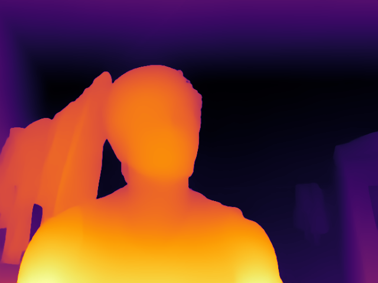
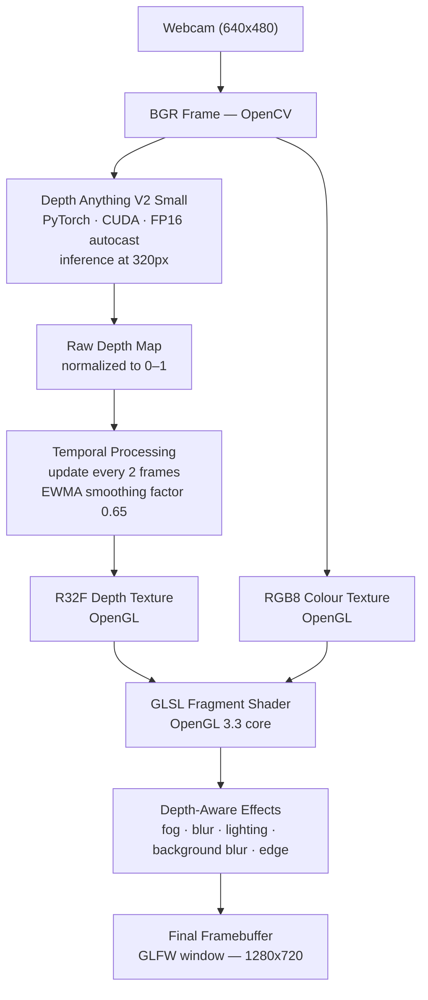

# DepthFX

### Real-Time AI Depth Estimation → GPU-Accelerated Visual Effects

**DepthFX** is a real-time computer vision and GPU rendering pipeline that estimates monocular depth from a live webcam feed and uses that depth map to drive GPU-accelerated visual effects — all running concurrently at interactive frame rates.

**Depth Anything V2 Small** runs on **PyTorch + CUDA with FP16 autocast** to produce per-frame depth maps. Those maps are uploaded as an **OpenGL R32F texture** and consumed by a **GLSL fragment shader** that applies depth-aware fog, blur, lighting, and background blur entirely on the GPU.



*Heatmap display mode — false-colour depth rendered by GLSL (`D` key cycles modes).*

---


---

## Architecture



> **Key distinction:** PyTorch/CUDA performs the AI depth inference. OpenGL/GLSL handles all real-time rendering and visual effects. The depth model does not execute inside GLSL.

---

## Features

- **Monocular depth estimation** — Depth Anything V2 Small (ViT-S encoder), CUDA-accelerated
- **FP16 autocast inference** — `torch.autocast` on CUDA; input stays FP32, compute runs FP16
- **Temporal depth processing** — depth runs every 2 frames; EWMA blend (`0.65 × prev + 0.35 × new`) keeps the map stable between updates
- **OpenGL R32F depth texture** — single-channel 32-bit float GPU texture; no precision loss from quantization
- **GLSL depth-aware fog** — smoothstep fog ramp applied per fragment based on scene distance
- **GLSL depth-aware blur** — multi-tap weighted blur, radius driven by per-pixel depth
- **GLSL depth-based background blur** — independent blur pass using a wider depth band for background separation
- **GLSL depth-edge enhancement** — depth-discontinuity highlights computed per fragment from neighbour samples
- **Mouse-controlled virtual light** — cursor position sets a screen-space point light; intensity is modulated by depth
- **Three effect intensity presets** — light / medium / strong; each preset configures six shader uniforms independently
- **Three display modes** — Normal (full effects), grayscale Depth, false-colour Heatmap
- **OpenGL screenshot capture** — `glReadPixels` reads the final framebuffer; saved as a timestamped PNG to `outputs/`
- **OpenGL GPU timer query** — `GL_TIME_ELAPSED` measures shader execution time; mean/min/max reported on exit

---

## How It Works

1. **Capture** — OpenCV opens the webcam at 640×480 via DirectShow (`cv2.CAP_DSHOW`) and reads a BGR frame each iteration.

2. **Depth inference** — Every 2nd frame, the BGR image is forwarded to `DepthEstimator.estimate()`. The ViT-S model runs `infer_image()` at 320px inside `torch.inference_mode()` combined with `torch.autocast(device_type="cuda", dtype=torch.float16)`. `torch.cuda.synchronize()` is called after inference to obtain accurate wall-clock timing.

3. **Temporal smoothing** — The incoming depth map is blended with the retained previous map: `current = 0.65 × previous + 0.35 × new`. On the first frame the map is used directly. This EWMA reduces per-frame flicker without perceptible lag.

4. **GPU texture upload** — The RGB frame is vertically flipped (OpenGL origin is bottom-left) and uploaded to an **RGB8 texture** bound to unit 0. The smoothed float32 depth array is uploaded to an **R32F texture** bound to unit 1, both via `glTexSubImage2D`.

5. **GLSL rendering** — A fullscreen triangle-pair quad covers the viewport. The fragment shader samples both textures at each fragment UV and executes the enabled effect passes.

6. **Depth-aware effects** — Every effect reads the R32F depth at the current fragment. Fog blends the scene colour toward a light-grey fog colour using `smoothstep` over the configured depth range. Blur radius and background blur factor both increase with distance. The virtual light attenuates with screen-space distance to the cursor and is further modulated by depth. A depth-edge term is added to boost discontinuity contrast.

7. **Display and profiling** — Buffers are swapped via GLFW. The window title updates every 250 ms with current FPS, last AI latency, and GPU shader time from the `GL_TIME_ELAPSED` query.

---

## Display Modes

Press **D** to cycle:

| Mode | Shader Behaviour |
|------|-----------------|
| **NORMAL** | Full RGB render with fog, blur, lighting, and edge effects |
| **DEPTH** | Outputs `vec3(depth)` — greyscale, closer surfaces appear brighter |
| **HEATMAP** | False-colour: blue (far) blends to green, then red (near) |

---

## Effect Levels

Press **1**, **2**, or **3**. All six parameters are passed as GLSL uniforms each frame from the `EFFECTS` dict in `gpu_depth_fx.py`:

| Uniform | Light (1) | Medium (2) | Strong (3) |
|---------|:---------:|:----------:|:----------:|
| `u_fog_strength` | 0.30 | 0.55 | 0.85 |
| `u_blur_strength` | 0.25 | 0.50 | 0.85 |
| `u_light_strength` | 0.35 | 0.65 | 0.95 |
| `u_ambient_strength` | 0.80 | 0.65 | 0.50 |
| `u_fog_start` | 0.55 | 0.35 | 0.20 |
| `u_fog_end` | 0.95 | 0.90 | 0.80 |

---

## Controls

| Key | Action |
|-----|--------|
| **D** | Cycle display mode: NORMAL → DEPTH → HEATMAP |
| **F** | Toggle depth-aware fog |
| **B** | Toggle depth-aware blur |
| **P** | Toggle depth-based background blur |
| **1** | Light effect preset |
| **2** | Medium effect preset *(default)* |
| **3** | Strong effect preset |
| **R** | Reset all settings to defaults |
| **S** | Capture screenshot → `outputs/depthfx_YYYYMMDD_HHMMSS.png` |
| **Q** | Quit |
| **Mouse** | Move the virtual light position |

---

## Performance

Measured on **NVIDIA GeForce RTX 4070 Laptop GPU** — CUDA 13.0, FP16 autocast, inference size 320:

| Metric | Measured |
|--------|--------:|
| AI inference per depth update | ~20 ms |
| Estimated AI throughput | ~48 FPS |
| AI update ratio (`DEPTH_UPDATE_INTERVAL = 2`) | ~50% |
| GPU shader time (`GL_TIME_ELAPSED`) | ~0.6–0.9 ms |

Setting `DEPTH_UPDATE_INTERVAL = 2` runs depth inference on every other rendered frame, halving AI compute cost. `DEPTH_SMOOTHING = 0.65` preserves visual stability across the skipped frames. GPU shader time stays well under 1 ms, so the bottleneck is always the AI inference pass.

Performance varies with GPU hardware, CUDA version, and scene complexity.

---

## Installation

> Requires **Windows** with an NVIDIA GPU and CUDA 13.0 drivers.

```powershell
git clone https://github.com/SudharsaaX/DepthFX.git
cd DepthFX

python -m venv .venv
.\.venv\Scripts\activate

pip install -r requirements.txt
```

`requirements.txt` pins `torch==2.13.0+cu130`, `torchvision==0.28.0+cu130`, `PyOpenGL==3.1.10`, `glfw==2.10.2`, `opencv-python==5.0.0.93`, `numpy==2.4.6`, `timm==1.0.28`, and `einops==0.8.2`.

---

## Model Setup

Model checkpoint files are **not included** (`.pth` is git-ignored). Download `depth_anything_v2_vits.pth` and place it at:

```
DepthFX/
└── checkpoints/
    └── depth_anything_v2_vits.pth
```

The application raises `FileNotFoundError` at startup if the file is absent.

Model configuration used by `DepthEstimator` (from `src/depth_estimator.py`):

```python
CHECKPOINT_PATH = BASE_DIR / "checkpoints" / "depth_anything_v2_vits.pth"

MODEL_CONFIG = {
    "encoder": "vits",
    "features": 64,
    "out_channels": [48, 96, 192, 384],
}
```

---

## Running

**Depth inference benchmark:**

```powershell
python src\depth_estimator.py
```

Runs 10 GPU warm-up frames, then 100 timed inference iterations. Reports average latency, estimated throughput FPS, and VRAM usage.

**Main real-time application:**

```powershell
python src\gpu_depth_fx.py
```

Loads the model, opens the GLFW window and webcam, and enters the real-time render loop.

---

## Project Structure

```
DepthFX/
├── assets/
│   └── images/
│       └── depth_test.png          # Depth heatmap example
├── checkpoints/                    # Model checkpoint — git-ignored
│   └── depth_anything_v2_vits.pth
├── outputs/                        # Runtime screenshots — git-ignored
├── archive/
│   └── old_experiments/
├── scripts/                        # Currently empty
├── tests/                          # Currently empty
├── src/
│   ├── depth_anything_v2/          # Model implementation (DPT + DINOv2)
│   │   ├── dpt.py
│   │   ├── dinov2.py
│   │   └── dinov2_layers/
│   ├── shaders/
│   │   └── fullscreen.vert         # Fullscreen quad vertex shader (GLSL 3.30)
│   ├── depth_estimator.py          # DepthEstimator class + benchmark entry point
│   ├── depth_utils.py              # normalize_depth() utility
│   └── gpu_depth_fx.py             # Main application: render loop, OpenGL, GLSL
├── requirements.txt
├── .gitignore
└── README.md
```

---

## Tech Stack

| Technology | Role |
|-----------|------|
| **Python 3.10+** | Application runtime |
| **PyTorch 2.13** | AI model inference framework |
| **Depth Anything V2 Small** | Monocular depth estimation (ViT-S encoder) |
| **CUDA 13.0** | GPU-accelerated AI compute |
| **torch.autocast (FP16)** | Half-precision inference without model conversion |
| **OpenCV 5.0** | Webcam capture and image preprocessing |
| **OpenGL 3.3 core** | GPU rendering pipeline |
| **GLSL** | Depth-aware fragment shader effects |
| **GLFW** | Window, input handling, and OpenGL context |
| **PyOpenGL 3.1** | Python bindings for OpenGL |
| **NumPy 2.4** | Array operations and depth map processing |
| **timm 1.0** | Vision transformer backbone support (DINOv2) |

---

## Limitations

- Produces **relative** depth normalized per frame to [0, 1] — not metric distance
- Targets **NVIDIA CUDA GPUs**; falls back to CPU inference but is not optimized for it
- Background blur separates layers by depth value, not by semantic content
- EWMA temporal smoothing can produce ghosting artefacts during fast motion
- Model checkpoint is not distributed with the repository
- No license is currently specified

---

## Future Work

- **TensorRT export** — reduce inference latency further beyond FP16 autocast
- **Improved temporal consistency** — optical-flow-guided depth warping between updates
- **Additional GLSL effects** — depth-of-field, SSAO approximation, chromatic aberration
- **Test suite** — unit tests for `depth_utils` and shader uniform handling
- **Open-source license**

---

*Built to demonstrate the engineering value of pairing fast AI depth inference with a GPU graphics pipeline — two distinct GPU workloads, PyTorch/CUDA and OpenGL/GLSL, running concurrently in a single real-time application.*