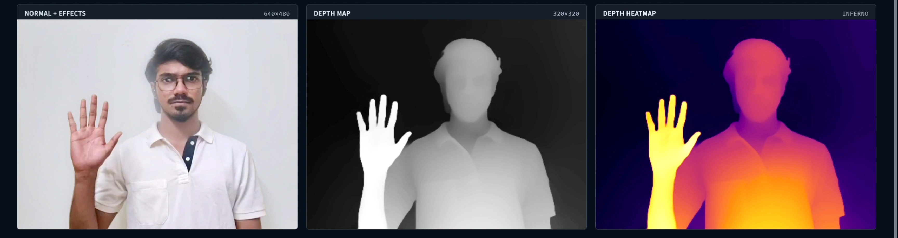
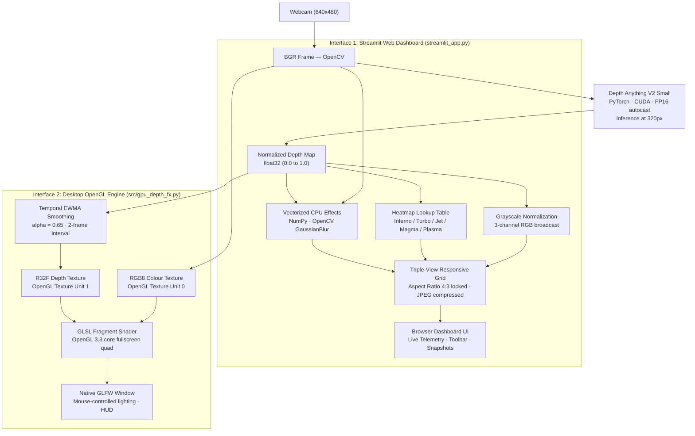

# DepthFX

### Real-Time AI Depth Estimation → GPU-Accelerated Visual Effects & Web Dashboard

**DepthFX** is a real-time computer vision and GPU rendering application that estimates monocular depth from a live webcam feed and uses that depth map to drive depth-aware visual effects — running concurrently at interactive frame rates.

The project offers **two complementary deployment interfaces**:
1. **Web Dashboard (`streamlit_app.py` / `run_app.bat`):** A modern, full-width dark-theme browser dashboard featuring synchronized triple-view feeds (Normal + Effects, Depth Map, Depth Heatmap), an integrated control toolbar, live 4-card hardware/AI telemetry, and panoramic snapshot capture.
2. **Desktop Graphics Engine (`src/gpu_depth_fx.py`):** A native OpenGL 3.3 Core Profile desktop application with custom GLSL fragment shaders executing depth-aware fog, blur, edge enhancement, and interactive mouse-controlled virtual point lighting.

**Depth Anything V2 Small** runs on **PyTorch + CUDA with FP16 autocast** to produce per-frame depth maps at $320\times 320$ resolution in ~10–15 ms on an RTX 4070.

---


---

## Live Demo & Pipeline Preview

<p align="center">
  <video src="assets/videos/InShot_20260902_015848586.mp4" width="100%" controls autoplay loop muted playsinline>
    <a href="assets/videos/InShot_20260902_015848586.mp4">Watch DepthFX Demo Video</a>
  </video>
</p>

<p align="center">
  <em>DepthFX Live Demonstration — Real-Time Monocular Depth Estimation &amp; Depth-Aware Visual Effects.</em>
</p>

<p align="center">
  
</p>

<p align="center">
  <em>DepthFX Real-Time Triple-View Pipeline — Live Camera &amp; Visual Effects (left), Grayscale Depth Map (center), and Thermal Heatmap (right).</em>
</p>

---

## Architecture



> **Key distinction:** PyTorch/CUDA handles the AI depth estimation across both interfaces. In the desktop application, visual effects are computed via GLSL fragment shaders on the GPU. In the web dashboard, visual effects are processed via optimized vectorized OpenCV/NumPy routines with JPEG WebSocket streaming.

---

## Features

### AI & Core Pipeline
- **Monocular depth estimation** — Depth Anything V2 Small (ViT-S encoder, DINOv2 backbone, DPT decoder head)
- **CUDA FP16 autocast inference** — `torch.autocast(device_type="cuda", dtype=torch.float16)` for accelerated Tensor Core compute
- **Zero-lag camera buffer clamping** — `cv2.CAP_PROP_BUFFERSIZE = 1` eliminates driver frame queuing
- **Hardware-synchronized latency measurement** — `torch.cuda.synchronize()` ensures accurate millisecond telemetry

### Streamlit Web Dashboard (`streamlit_app.py`)
- **Always-on live streaming** — auto-starts stream upon page launch without manual triggers
- **Triple-view layout** — displays **Normal + Effects**, **Depth Map**, and **Depth Heatmap** side-by-side
- **Responsive 4:3 aspect ratio locking** — custom CSS ensures camera video fills cards edge-to-edge with zero letterboxing
- **Integrated toolbar** — control heatmap palette (`Inferno`, `Turbo`, `Jet`, `Magma`, `Plasma`), atmospheric fog, depth blur, background blur, presets, and camera device (0–10)
- **Real-time telemetry grid** — 4 responsive cards updating at 2 Hz:
  - *Performance:* Live FPS, AI Latency (ms), Inference Rate (1:1), AI Resolution (320×320), Motion Delay
  - *System Status:* Camera state, AI Model status, CUDA Engine, Pipeline status, Active Renderer
  - *Hardware:* GPU device identifier, CUDA version, PyTorch version, Compute Capability, Host OS
  - *AI Model:* Architecture, Backbone, Decoder Head, Precision, Model weights checkpoint
- **Panoramic snapshot capture** — concatenates all 3 feeds horizontally (`np.hstack`) to a $1920\times 480$ PNG in `outputs/`
- **One-click batch launcher** — Windows `run_app.bat` handles virtual environment activation and dashboard startup

### Desktop OpenGL Engine (`src/gpu_depth_fx.py`)
- **GLSL depth-aware fog** — smoothstep atmospheric fog ramp applied per-fragment based on depth
- **GLSL depth-aware blur** — multi-tap weighted blur with depth-dependent radius
- **GLSL background blur** — wider transition band targeting portrait-mode background separation
- **GLSL depth-edge enhancement** — 4-neighbor depth-discontinuity detection boosting edge contrast
- **Interactive mouse-controlled lighting** — real-time 3D-like virtual spotlight positioned by cursor and modulated by depth
- **Temporal smoothing (EWMA)** — $0.65 \times \text{previous} + 0.35 \times \text{new}$ reduces flicker across 2-frame update intervals
- **OpenGL R32F texture** — single-channel 32-bit floating-point GPU texture preserves continuous depth precision
- **GPU timer query** — hardware-level `GL_TIME_ELAPSED` timer queries measure sub-millisecond shader execution

---

## Effect Presets

Both interfaces provide three calibrated presets configuring fog density, blur radii, and transition bands:

| Preset | Fog Strength | Blur Strength | Fog Start (`fs`) | Fog End (`fe`) |
|:-------|:------------:|:-------------:|:--------------:|:------------:|
| **LIGHT (1)** | 0.30 | 0.25 | 0.55 | 0.95 |
| **MEDIUM (2)** *(default)* | 0.55 | 0.50 | 0.35 | 0.90 |
| **STRONG (3)** | 0.85 | 0.85 | 0.20 | 0.80 |

---

## Quick Start & Running

### 1. Installation

> Requires **Windows** with an NVIDIA GPU and CUDA drivers.

```powershell
git clone https://github.com/SudharsaaX/DepthFX.git
cd DepthFX

python -m venv .venv
.\.venv\Scripts\activate

pip install -r requirements.txt
```

### 2. Model Checkpoint Setup

Download `depth_anything_v2_vits.pth` (~94.6 MB) and place it in the `checkpoints/` directory:

```
DepthFX/
└── checkpoints/
    └── depth_anything_v2_vits.pth
```

### 3. Launching the Application

#### Option A: Streamlit Web Dashboard (Recommended)

Single-click launcher:
```powershell
.\run_app.bat
```
*Or run directly:*
```powershell
streamlit run streamlit_app.py
```
Open your browser at `http://localhost:8501`.

#### Option B: Native Desktop OpenGL Engine

```powershell
python src\gpu_depth_fx.py
```

**Desktop Keyboard Controls:**
| Key | Action |
|:---:|:-------|
| **D** | Cycle display mode: NORMAL → DEPTH → HEATMAP |
| **F** | Toggle atmospheric fog |
| **B** | Toggle depth-aware blur |
| **P** | Toggle background blur |
| **1 / 2 / 3** | Switch presets: Light / Medium / Strong |
| **R** | Reset all settings to defaults |
| **S** | Save framebuffer screenshot to `outputs/` |
| **Q** | Quit application |
| **Mouse** | Reposition virtual point light |

#### Option C: Standalone Depth Benchmark

```powershell
python src\depth_estimator.py
```
Runs 10 warmup inferences followed by 100 timed iterations, reporting average latency, throughput FPS, and VRAM consumption.

---

## Performance

Measured on an **NVIDIA GeForce RTX 4070 Laptop GPU** (CUDA 13.0, FP16 autocast, 320×320 inference):

| Metric | Desktop OpenGL Engine | Streamlit Web Dashboard |
|:-------|----------------------:|------------------------:|
| **AI Inference Latency** | ~20 ms | ~10–15 ms |
| **AI Update Interval** | Every 2 frames | Every frame (1:1) |
| **Display Framerate** | 45–60 FPS | 28–35 FPS (browser WebSocket limited) |
| **Shader / Effect Time** | ~0.6–0.9 ms (GLSL) | ~3–5 ms (vectorized CPU) |
| **Output Resolution** | 1280×720 window | Responsive 640×480 per panel |

---

## Project Structure

```
DepthFX/
├── .streamlit/
│   └── config.toml                 # Streamlit theme and server configuration
├── assets/
│   ├── images/
│   │   ├── DepthFX_CoverImage.png  # High-resolution project cover banner
│   │   ├── depth_test.jpg          # Real-time triple-view live pipeline screenshot
│   │   ├── depth_test_.png         # Depth heatmap visualization example
│   │   └── sample.png              # Visual effects & depth estimation sample showcase
│   └── videos/
│       └── InShot_20260902_015848586.mp4 # Real-time live demo recording
├── checkpoints/
│   └── depth_anything_v2_vits.pth  # Model weights (git-ignored)
├── outputs/                        # Saved snapshots (git-ignored)
├── archive/
│   └── old_experiments/            # Prototype history (CPU effects, test scripts)
├── scripts/                        # Utility scripts
├── tests/                          # Test suite directory
├── src/
│   ├── depth_anything_v2/          # Depth Anything V2 implementation (DINOv2 + DPT)
│   │   ├── dpt.py
│   │   ├── dinov2.py
│   │   ├── dinov2_layers/
│   │   └── util/
│   ├── shaders/
│   │   └── fullscreen.vert         # External vertex shader
│   ├── depth_estimator.py          # DepthEstimator class & benchmark tool
│   ├── depth_utils.py              # Depth normalization utilities
│   └── gpu_depth_fx.py             # Desktop OpenGL 3.3 Core application
├── run_app.bat                     # Single-click launcher for Streamlit dashboard
├── streamlit_app.py                # Streamlit Web Dashboard application
├── PROJECT_REPORT.md               # 10-part comprehensive technical analysis report
├── requirements.txt                # Pinned dependencies
├── .gitignore
└── README.md
```

---

## Tech Stack

| Technology | Role |
|:-----------|:-----|
| **Python 3.10+** | Core runtime environment |
| **PyTorch 2.13** | Deep learning framework & CUDA execution |
| **Depth Anything V2 Small** | Monocular depth foundation model (ViT-S encoder) |
| **CUDA 13.0 & FP16 Autocast** | GPU-accelerated inference with Tensor Core utilization |
| **Streamlit 1.42** | Web application dashboard, UI layout & reactive controls |
| **OpenGL 3.3 Core** | Desktop hardware graphics rendering pipeline |
| **GLSL 3.30** | Fragment shader code for real-time post-processing |
| **GLFW & PyOpenGL** | Desktop window management & OpenGL bindings |
| **OpenCV 5.0** | Camera capture, frame processing, and colormap generation |
| **NumPy 2.4** | High-performance array manipulation and composite stacking |
| **Pillow 12.3** | Desktop HUD text and overlay generation |
| **timm 1.0 & einops** | Vision Transformer backbone utilities |

---

## Comprehensive Project Report

For a complete 10-part architectural breakdown, technical interview Q&As, mathematical formulations, and engineering design justifications, refer to:

👉 **[PROJECT_REPORT.md](PROJECT_REPORT.md)**

---

## License & Attribution

Depth Anything V2 is authored by TikTok/ByteDance. This project pairs Depth Anything V2 with custom GPU rendering pipelines and modern web dashboard interfaces for real-time computer vision demonstration.

---

*Built to demonstrate the engineering value of pairing fast AI depth inference with GPU rendering pipelines and responsive browser interfaces — running concurrently in a single real-time application.*